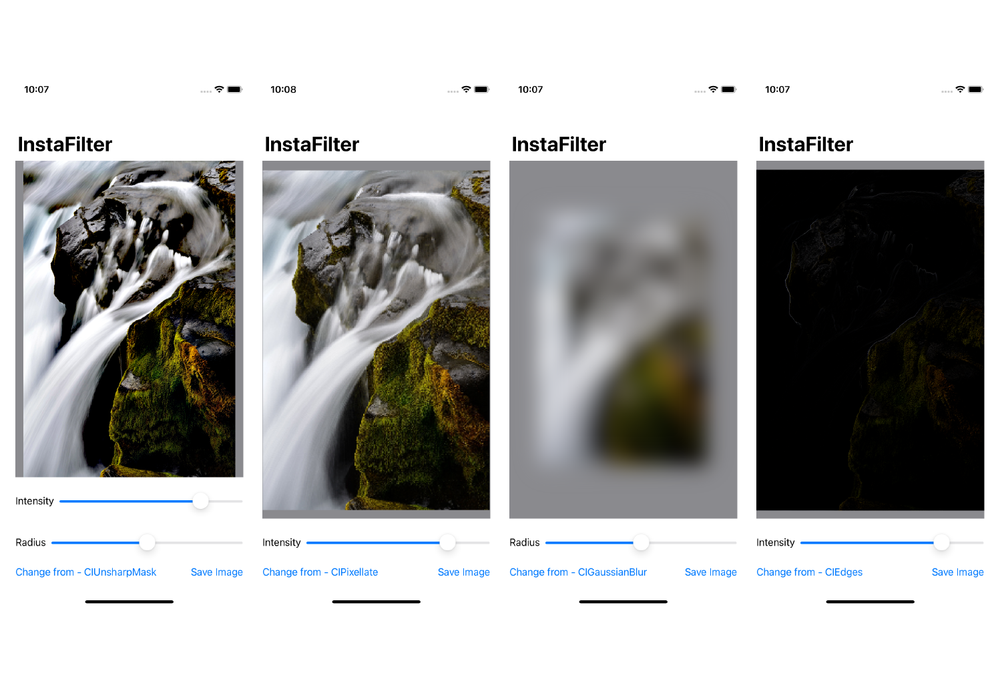
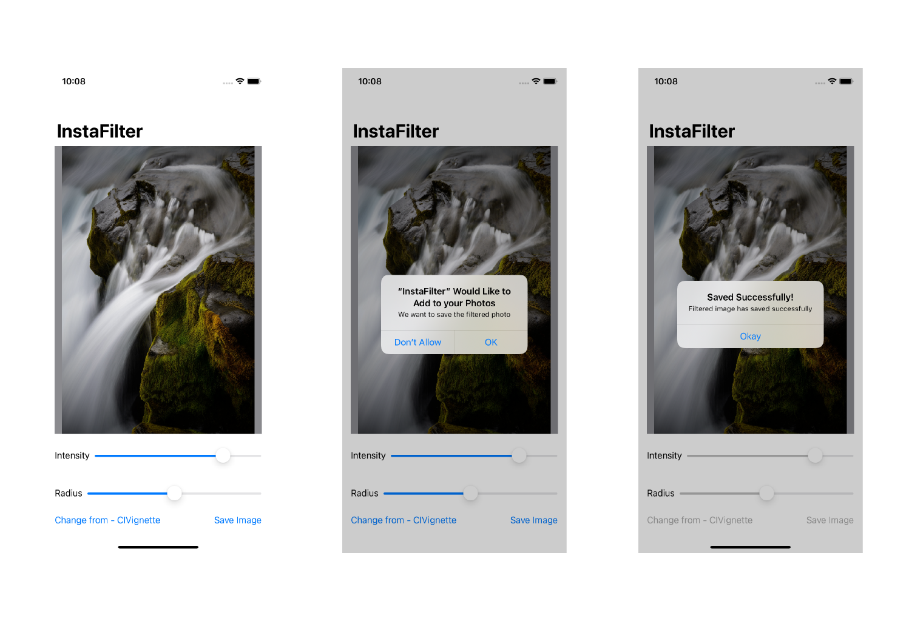

# InstaFilter

Image Filtering application using ``CoreImage's`` built-in filter library and image processing APIs in Swift

### Features are:
* Creating custom bindings in SwiftUI
* Integrating ``ActionSheet``  & ``Core Image`` in SwiftUI
* Wrapping a ``UIViewController`` in a SwiftUI view
* Adding User permissions and logic based code in Controllers & ``Coordinators``
* Writing closures as variables

##### Screenshots

